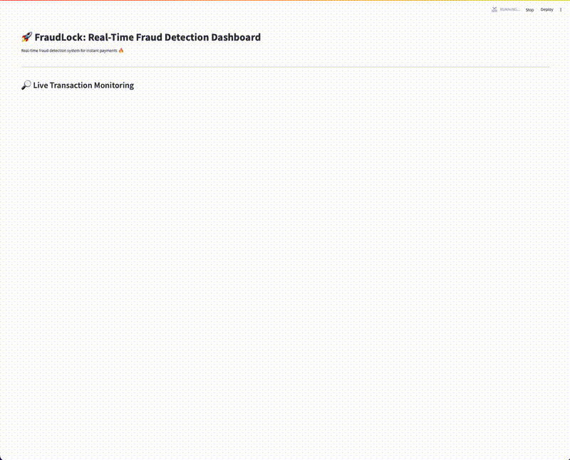

#  FraudLock : Real-Time Fraud Detection System

Protecting real-time payments (like FedNow, RTP) by detecting and locking fraudulent transactions as they happen.

---



---

## 📄 Project Overview

**FraudLock** is a real-time AI-based fraud detection system that:

- Detects fraudulent instant payment transactions as they occur
- Streams transactions one-by-one in real-time
- Locks suspicious transactions instantly with fraud probability
- Provides a live fraud monitoring dashboard (Streamlit App)
- Allows full audit trail downloads
- Supports manual transaction fraud checking by analysts

Built using:
- 🧠 Random Forest (trained on financial transaction data)
- 🔥 Streamlit for real-time dashboards
- 📈 Live transaction monitoring + fraud detection alerts

---


## Download the Dataset

The dataset used for training and simulation is the **[Synthetic Financial Dataset For Fraud Detection](https://www.kaggle.com/datasets/ealaxi/paysim1)** available on Kaggle.

To download:

1. Go to the Kaggle dataset page:  
    [Synthetic Financial Dataset For Fraud Detection on Kaggle](https://www.kaggle.com/datasets/ealaxi/paysim1)

2. Download the CSV file (`PS_20174392719_1491204439457_log.csv`).

3. Create a folder named `raw/` inside your project at:

    ```
    fraudlock/data/raw/
    ```

4. Place the downloaded CSV file inside the `raw/` folder.

5. You are now ready to preprocess, train, or run the app!

>  **Note:** If you use a different dataset or file name, make sure to update your paths inside the code accordingly.

---

### Running the Jupyter Notebooks

The project also includes Jupyter notebooks for EDA, feature engineering, and model training.

1. Install Jupyter Notebook if you don't have it:
    ```bash
    pip install notebook
    ```

2. Navigate to the `notebooks/` folder:
    ```bash
    cd notebooks
    ```

3. Launch Jupyter Notebook:
    ```bash
    jupyter notebook
    ```

4. Open and run the following notebooks:
    - `01_data_eda.ipynb`
    - `02_feature_engineering.ipynb`
    - `03_model_training.ipynb`
    - `04_real_time_simulation.ipynb`

✅ Each notebook builds up the complete fraud detection system step-by-step.

---

## 🚀 Running the code

1. Clone the repo:
    ```bash
    git clone https://github.com/yourusername/FraudLock.git
    cd FraudLock
    ```

2. Install dependencies:
    ```bash
    pip install -r requirements.txt
    ```

3. Run the Streamlit app:
    ```bash
    streamlit run dashboard/streamlit_app.py
    ```

✅ The dashboard will open automatically in your browser!

---

## Demo

👉 Real-time fraud detection, transaction monitoring, fraud probability tracking, and audit log generation.

)

---

## 📊 Features

- Real-time transaction fraud detection
- Live transaction summary table
- Live frauds-only table
- Fraud detection counters and fraud rate calculation
- Download full transaction log (CSV) 
- Manual ad-hoc transaction fraud check (optional)

---

## 💬 Future Improvements

- Integrate a live database or payment API stream
- Adjustable fraud detection sensitivity (threshold control)
- Real-time charts and fraud heatmaps
- Streamlit Cloud or AWS public deployment

---

## 👨‍💻 Author

Built with ❤️ by Dilshath Shaik 

[](https://www.linkedin.com/in/shaik-dilshath/)

---

